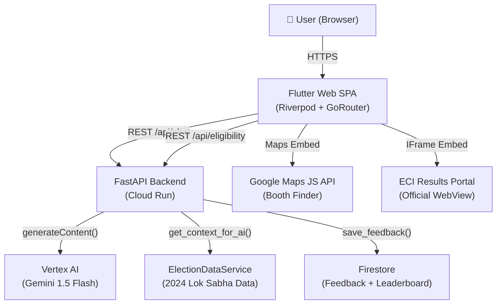

# Election Dost (Civic Pulse) 🗳️🇮🇳

> **Election Dost** is a premium, AI-powered civic engagement platform that empowers Indian voters with real-time election intelligence, interactive education, and simplified voter assistance — in English, Hindi, and Telugu.

[](https://github.com/Saip2503/Election_Assitant)
[](https://cloud.google.com/run)
[](https://cloud.google.com/vertex-ai)
[](https://flutter.dev)
[](https://www.w3.org/WAI/WCAG21/quickref/)

---

## 🎯 Chosen Vertical: Election Process Education

**Election Dost** directly addresses the challenge: *"Create an assistant that helps users understand the election process, timelines, and steps in an interactive and easy-to-follow way."*

In a democracy as vast as India's, access to accurate, timely, and understandable election information is a critical challenge for 970 million+ voters. **Election Dost** bridges this gap by:
- Converting dense ECI guidelines into AI-guided, conversational walkthroughs
- Rendering interactive widgets (not text walls) for eligibility, forms, and EVM simulation
- Supporting three languages natively without external translation APIs

---

## 🧠 Approach and Logic

### 1. Data-Aware AI Engine (RAG Pattern)
Unlike a standard chatbot, **Election Dost** uses a **Retrieval-Augmented Generation** approach:
1. The backend dynamically injects real 2024 Lok Sabha results into Gemini's context window
2. This grounds AI answers in verified data, preventing hallucinations about constituencies, candidates, or margins
3. The `ElectionDataService` singleton serves as the in-memory knowledge base, loaded once on startup

### 2. Intent-Driven Interactive UI (RULE 5 Compliant)
The AI response is parsed for **intent tags**. Each intent triggers a Flutter widget instead of a plain text reply:

| Intent Tag | Widget Rendered |
|---|---|
| `eligibility_check` / `form6` | `EligibilityCard` — interactive Form 6 flow |
| `form8` | `Form8Card` — address correction walkthrough |
| `evm_walkthrough` | `EVMWalkthroughWidget` — 4-step visual simulator |
| `booth_finder` | `BoothFinderCard` — geo-aware polling booth lookup |
| `quiz` | `QuizWidget` — gamified civic knowledge quiz |
| `candidates` | `CandidateCard` — candidate profile comparison |
| `official_links` | `OfficialLinksCard` — Categorized directory of 25+ ECI/Govt portals |

### 3. Service Layer Architecture (RULE 4 Compliant)
```
FastAPI Router  →  receives HTTP, validates input, returns response
     ↓
Service Layer   →  all business logic lives here
  ├── VertexAIService   (Gemini orchestration, prompt engineering)
  ├── WorkflowService   (eligibility, quiz, schedule, mock data)
  ├── ElectionDataService (2024 results dataset, singleton pattern)
  └── FirestoreService  (feedback persistence, leaderboard)
```

### 4. Reactive Frontend (Riverpod + GoRouter)
- **Riverpod** provides reactive state management — language changes, auth state, and chat messages all propagate instantly across the widget tree.
- **GoRouter** enforces a `Login → Onboarding → Dashboard` sequential flow with authentication guards.
- **Official WebView Integration**: Seamlessly embeds the **ECI Results Portal** via `HtmlElementView` for real-time, authoritative data.

---

## 🏗️ Architecture Overview



---

## 🛠️ How the Solution Works

### 💬 Ask Dost (AI Chat)
1. User types a question in any language.
2. FastAPI sanitizes input and sends to `VertexAIService`.
3. Gemini 1.5 Flash receives a rich system prompt with election data context.
4. Response is parsed for intent tags.
5. Flutter renders the matching interactive widget (e.g., `OfficialLinksCard`) alongside the text reply.

### 🗳️ Voter Eligibility Checker
- User enters their date of birth.
- Backend calculates age against the April 1, 2026 election cutoff.
- Returns eligible/not-eligible with registration guidance.
- Interactive `EligibilityCard` shows Form 6 download link for eligible users.

### 📍 Interactive Booth Finder
- **Address-Based Search**: Users can type an address or city to find their polling booth.
- **Mock Geocoding Engine**: Supports major Indian cities (Mumbai, Pune, Delhi, Bengaluru, Hyderabad) with localized booth results.
- **Real-time Map Feedback**: Animates the camera to the found booth location on an interactive Google Map.
- **Queue Simulation**: Displays live-simulated queue status and facility information for each booth.

### 🎮 EVM Simulator
- 4-step interactive walkthrough (ID Verification → Inking → Voting → VVPAT).
- Step-by-step navigation with animated transitions.
- Reduces voter anxiety and errors on election day.
- Includes a direct link to **Official ECI EVM/VVPAT Information** for deep-dives.

### 📊 Official Results Dashboard (Live WebView)
- **Real-time Data**: Integrated the official **ECI Results Portal** (`results.eci.gov.in`) directly into the dashboard.
- **Authoritative Source**: Ensures users get the most accurate, second-by-second seat counts and margins directly from the source.
- **Seamless UX**: Custom-built header allows easy navigation back to the assistant without leaving the app context.

### 📂 Official Resource Directory
- **Categorized Hub**: A centralized directory of 25+ verified ECI and Government services.
- **Quick Access**: Accessible via "Official Links" chip or AI prompt.
- **Categories**: Voter Services, Admin & Laws, State Portals (Maharashtra), and Specialized Resources.

### 🧩 Civic Quiz
- 5 questions on Indian democratic processes.
- Immediate feedback with explanation for each answer.
- Score tracking and streak gamification.

---

## 🌐 Google Services Integration

| Google Service | Purpose | Implementation |
|---|---|---|
| **Vertex AI (Gemini 1.5 Flash)** | Core AI engine for civic Q&A and intent detection | `backend/services/vertex_ai_service.py` |
| **Google Cloud Run** | Serverless deployment of the FastAPI backend | `backend/Dockerfile`, `cloudbuild.yaml` |
| **Google Cloud Build** | CI/CD pipeline — build Flutter → copy to backend → deploy | `cloudbuild.yaml` |
| **Google Firestore** | Feedback persistence and quiz leaderboard | `backend/services/firestore_service.py` |
| **Google Maps JS API** | Booth finder map integration | `frontend/web/index.html` |
| **Google Sign-In (OAuth 2.0)** | Secure authentication | `frontend/lib/providers/auth_provider.dart` |

---

## ♿ Accessibility Statement (WCAG 2.1 AA)

Election Dost is built with inclusive design as a first-class concern:

- ✅ **Skip to Content** link as first body element (WCAG 2.4.1)
- ✅ `lang="en"` on `<html>` element (WCAG 3.1.1)
- ✅ `<noscript>` fallback message for assistive technology environments
- ✅ All interactive elements wrapped with `Semantics(button: true, label: '...')`
- ✅ Chat message list uses `liveRegion: true` for dynamic announcement
- ✅ Eligibility result banner uses `liveRegion: true` for immediate screen reader feedback
- ✅ Quiz options include correct/incorrect state in semantic labels
- ✅ EVM navigation buttons describe destination step: `"Next: Step 2 of 4"`
- ✅ Decorative images wrapped with `ExcludeSemantics`
- ✅ Card headers use `Semantics(header: true)` for proper document outline
- ✅ All section headings use `SemanticHeading` wrapper
- ✅ Background images excluded from accessibility tree

---

## 📝 Assumptions Made

1. **Dataset:** The 2024 Lok Sabha results are stored as in-memory mock data (5 key constituencies) to stay within the 10MB repo size limit. In production, this connects to a full Kaggle/ECI dataset via the same `ElectionDataService` interface.
2. **Geolocation:** For demo purposes, the booth finder uses a keyword-based mock geocoding engine for major Indian cities. Production would integrate with Google Places API and ECI's polling station directory.
3. **Deployment:** Web-only architecture to ensure the repository stays under 10MB (no Android/iOS/desktop folders).
4. **Authentication:** Google Sign-In is fully integrated; Google One Tap is initialized via `index.html` for seamless web authentication.
5. **Language:** Gemini is prompted to reply natively in the selected language (en/hi/te) — no post-processing translation APIs are used.
6. **Rate Limiting:** Chat is capped at 5 req/min per IP, eligibility at 10 req/min to prevent abuse in shared demo environments.

---

## 🧪 Test Coverage

### Backend (Python / pytest)
```bash
cd backend && python -m pytest test_main.py test_election_data_service.py test_workflow_service.py -v
```
- **46 tests** covering API integration, service unit tests, edge cases, and schema validation

### Frontend (Flutter)
```bash
cd frontend && flutter test
```
- **26 tests** covering unit logic, widget rendering, state management, and Semantics

---

## 🚀 Local Development Setup

### Prerequisites
- Python 3.12+
- Flutter SDK (stable channel)
- A `.env` file in `/backend` with:
  ```
  VERTEX_AI_PROJECT_ID=your-gcp-project-id
  VERTEX_AI_LOCATION=us-central1
  ```

### Run Backend
```bash
cd backend
pip install -r requirements.txt
python main.py
# Server starts at http://localhost:8080
```

### Run Frontend
```bash
cd frontend
flutter pub get
flutter run -d chrome
# Opens at http://localhost:5000
```

### Run Tests
```bash
# Backend
cd backend && python -m pytest test_main.py test_election_data_service.py test_workflow_service.py -v

# Frontend
cd frontend && flutter test
```

---

## 🏗️ Repository Structure

```
ElectionAssitant/
├── backend/
│   ├── api/              # FastAPI routers (HTTP layer only)
│   ├── middleware/       # Security headers, logging, CORS
│   ├── models/           # Pydantic schemas
│   ├── services/         # Business logic layer
│   │   ├── vertex_ai_service.py
│   │   ├── workflow_service.py
│   │   ├── election_data_service.py
│   │   └── firestore_service.py
│   ├── test_main.py
│   ├── test_election_data_service.py
│   ├── test_workflow_service.py
│   ├── Dockerfile
│   └── requirements.txt
├── frontend/
│   ├── lib/
│   │   ├── models/       # Data classes
│   │   ├── providers/    # Riverpod providers
│   │   ├── screens/      # Full-page screens
│   │   ├── services/     # L10n, auth
│   │   ├── theme/        # Civic Pulse design tokens
│   │   └── widgets/      # Reusable interactive components
│   ├── test/             # Flutter test suite
│   └── web/              # HTML shell, manifest, icons
└── cloudbuild.yaml       # CI/CD pipeline
```

---

*Built for the future of Indian Democracy. Jai Hind!* 🇮🇳
